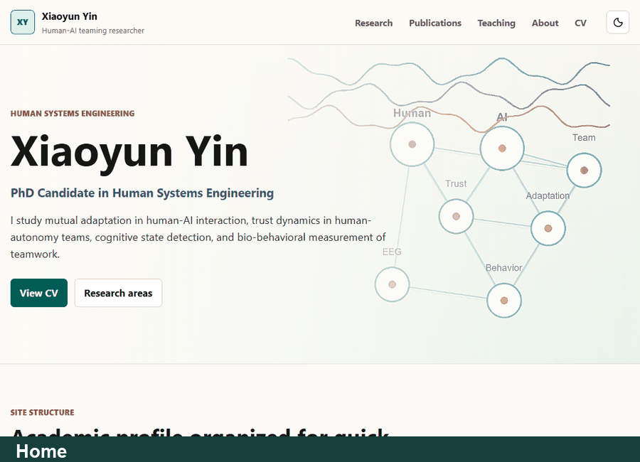

# WEB103 Project 1 - Listicle Part 1

Submitted by: **Xiaoyun Yin**

About this web app: **A responsive academic CV and research portfolio for Xiaoyun Yin. The site presents research areas, publications, teaching and mentoring, education, awards, professional service, technical skills, a timeline, and a downloadable PDF CV.

I apologize to make it Narcissus, but I'm eager to have a personal web so that I can post it for my job hunting.
**

Time spent: **About 3 hours**

## Required Features

The following **required** functionality is completed:

- [x] **The web app uses only HTML, CSS, and JavaScript without a frontend framework**
- [x] **The web app displays a title**
- [x] **The web app displays at least five unique list items, each with at least three displayed attributes**
  - The home page displays five site-map cards: Research, Publications, Teaching, About, and CV.
  - Each card displays a title, route, and section summary.
- [x] **The user can click on each item in the list to see a detailed view of it**
  - [x] **Each detail view has a unique endpoint**
  - Implemented endpoints: `/research`, `/publications`, `/teaching`, `/about`, and `/cv`.
- [ ] **The web app serves an appropriate 404 page when no matching route is defined**
- [ ] **The web app is styled using Picocss**

The following **optional** features are implemented:

- [x] The web app displays items in a unique format, such as cards rather than lists or animated list items

The following **additional** features are implemented:

- [x] Light/dark theme toggle with saved preference
- [x] Responsive desktop and mobile layouts
- [x] Sticky navigation bar with active-page state
- [x] Footer with contact email and ORCID link
- [x] Downloadable PDF CV
- [x] Research-themed hero visual
- [x] Dedicated pages for research, publications, teaching, about, and CV timeline

## Video Walkthrough

Here's a walkthrough of implemented features:



GIF created with **Playwright screenshots and Pillow**.

## Notes

This project started from a small static client/server starter and was redesigned into a personal academic CV website. The main challenge was adapting the original WEB103 checklist to a portfolio-style app: the current site has unique routed detail pages and card-based content, but it does not use PicoCSS and does not yet include a dedicated 404 page.

To run locally:

```bash
cd client
npm install
npm run dev
```

Then open `http://127.0.0.1:5173/`.

## License

Copyright 2026 Xiaoyun Yin

Licensed under the Apache License, Version 2.0 (the "License"); you may not use this file except in compliance with the License. You may obtain a copy of the License at

> http://www.apache.org/licenses/LICENSE-2.0

Unless required by applicable law or agreed to in writing, software distributed under the License is distributed on an "AS IS" BASIS, WITHOUT WARRANTIES OR CONDITIONS OF ANY KIND, either express or implied. See the License for the specific language governing permissions and limitations under the License.
